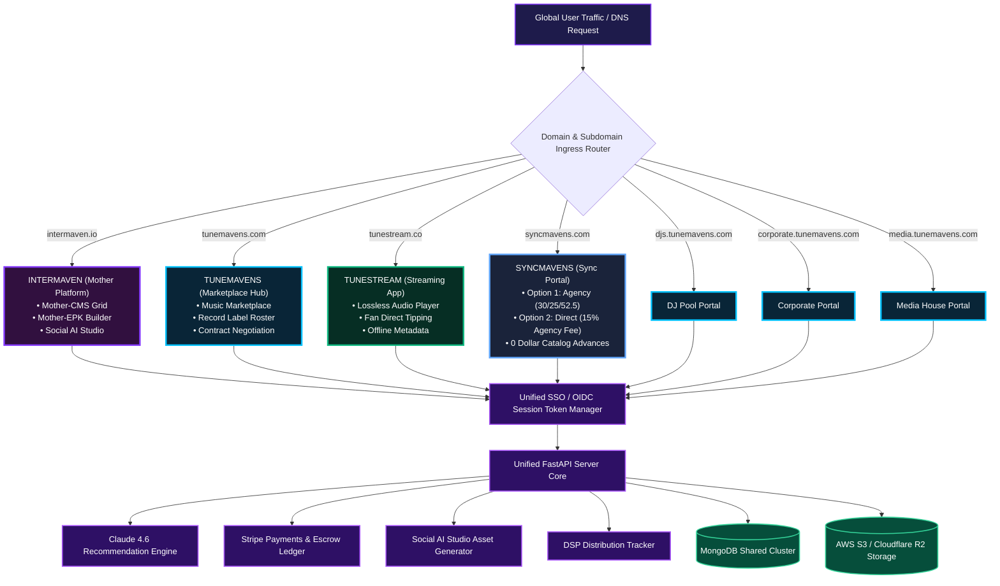

# Ecosystem Architecture & Flowchart Diagram Document

<div align="center">
  
  <br/><br/>
  <table border="0" style="border: none; border-collapse: collapse;">
    <tr>
      <td align="center" style="padding: 10px; border: none;"></td>
      <td align="center" style="padding: 10px; border: none;"></td>
      <td align="center" style="padding: 10px; border: none;"></td>
    </tr>
  </table>
</div>

---

## 1. System Architecture Overview

The Intermaven Ecosystem is architected as a **Unified Monorepo with Multi-Target Frontend Bundles** backed by a centralized **FastAPI Python Backend** and a high-availability **MongoDB Data Cluster**.

### Architecture Blueprint

```
                                  +---------------------------------------+
                                  |    DNS & NGINX DOMAIN ROUTING SLI     |
                                  +---------------------------------------+
                                      |            |           |        |
           +--------------------------+            |           |        +--------------------------+
           |                                       |           |                                   |
           v                                       v           v                                   v
+-----------------------+               +-----------------------+               +-----------------------+               +-----------------------+
|  INTERMAVEN PORTAL    |               |  TUNEMAVENS PORTAL    |               |   TUNESTREAM APP      |               |   SYNCMAVENS PORTAL   |
|  (intermaven.io)      |               |  (tunemavens.com)     |               |   (tunestream.co)     |               |   (syncmavens.com)    |
|                       |               |                       |               |                       |               |                       |
| - Mother-CMS Grid     |               | - Music Marketplace   |               | - Lossless Player     |               | - Ditto Sync Portal   |
| - Mother-EPK Builder  |               | - Record Label Hub    |               | - Fan Tipping Engine  |               | - Option 1 (30/25/52)|
| - Social AI Studio    |               | - Contract Negotiation|               | - Offline Cache       |               | - Option 2 (15% Agency)|
+-----------------------+               +-----------------------+               +-----------------------+               +-----------------------+
           |                                       |           |                                   |
           +--------------------------+            |           |        +--------------------------+
                                      |            |           |        |
                                      v            v           v        v
                                  +---------------------------------------+
                                  |    SHARED FRONTEND PACKAGES           |
                                  |  - packages/shared-ui                 |
                                  |  - packages/shared-auth               |
                                  +---------------------------------------+
                                                     |
                                                     v
                                  +---------------------------------------+
                                  |    UNIFIED FASTAPI BACKEND SERVER     |
                                  |  - OIDC/PKCE SSO & Session Cookies    |
                                  |  - Stripe Payments & Escrow Ledger    |
                                  |  - AI Recommendation Agent (Claude)   |
                                  +---------------------------------------+
                                                     |
                                                     v
                                  +---------------------------------------+
                                  |    MONGODB DATA CLUSTER & AWS S3      |
                                  |  - Shared Users & Entitlements        |
                                  |  - Catalogs, Briefs, Pitches, Feeds   |
                                  +---------------------------------------+
```

---

## 2. Platform Interconnection & Data Flow Diagrams

### Flowchart 1: Ecosystem Platform Connectivity & Ingress Architecture



---

### Flowchart 2: Inter-Platform Data & Financial Stream Flowchart

This flowchart demonstrates the exact multi-directional flow of audio assets, user auth sessions, licensing revenue, and activity events across the 4 platforms.

```mermaid
flowchart LR
    %% Subgraph Styling
    classDef platformNode fill:#131b2e,stroke:#3b82f6,stroke-width:2px,color:#fff;
    classDef dataFlow fill:#1e1b4b,stroke:#a855f7,stroke-width:2px,color:#fff;
    classDef financialFlow fill:#064e3b,stroke:#10b981,stroke-width:2px,color:#fff;

    subgraph TM_Platform ["TuneMavens (Marketplace Hub)"]
        TM_Ingest["Audio Stem & Metadata Ingestion"]
        TM_Contracts["Contract Negotiation & Split Ledgers"]
    end

    subgraph SM_Platform ["SyncMavens (Sync Portal)"]
        SM_Matcher["AI Brief Match Simulator"]
        SM_Option1["Option 1: Agency (30/25/52.5)"]
        SM_Option2["Option 2: Direct (15% Agency Fee)"]
    end

    subgraph TS_Platform ["TuneStream (Streaming App)"]
        TS_Player["Lossless Stream Player"]
        TS_Tipping["Direct Fan Tipping"]
    end

    subgraph IM_Platform ["Intermaven (Mother Platform)"]
        IM_SocialAI["Social AI Studio (Gemini/Sora)"]
        IM_CMS["Mother-CMS & EPK Builder"]
    end

    subgraph Core_Services ["Unified Core & Infrastructure"]
        SSO["SSO Auth Engine (.tunemavens.com)"]
        MongoDB[("MongoDB Cluster")]
        S3["AWS S3 Stems Storage"]
        Stripe["Stripe Escrow Wallet"]
    end

    %% Data Connections & Flows
    TM_Ingest -- "1. Upload Audio Stems" --> S3
    TM_Ingest -- "2. Upsert Metadata & ISRCs" --> MongoDB
    
    TM_Ingest -- "3. Sync Catalog Stems" --> SM_Matcher
    SM_Matcher -- "4. Match Briefs & Deliver Pitch" --> SM_Option1
    SM_Matcher -- "4. Index 'Sync Ready' Gallery" --> SM_Option2
    
    SM_Option1 -- "5. Disburse Waterfall (30/25/52.5)" --> Stripe
    SM_Option2 -- "5. Disburse Waterfall (15% Agency)" --> Stripe

    TM_Ingest -- "6. Publish Release Tracks" --> TS_Player
    TS_Tipping -- "7. Direct Fan Tips & Streams" --> Stripe
    TS_Player -- "8. Fanout Stream Events" --> MongoDB

    IM_SocialAI -- "9. Generate 1:1 & 9:16 Assets" --> IM_CMS
    IM_CMS -- "10. Dispatch Social & CRM Invites" --> TS_Player

    SSO -. "Shared Auth Session Token" .-> TM_Platform
    SSO -. "Shared Auth Session Token" .-> SM_Platform
    SSO -. "Shared Auth Session Token" .-> TS_Platform
    SSO -. "Shared Auth Session Token" .-> IM_Platform

    Stripe ==> "Final Payout Disbursed to Creator Wallet" ==> TM_Contracts
```

---

## 3. Data Schema & MongoDB Collection Index

The entire ecosystem persists through unified MongoDB collections shared across all 4 applications:

| Collection Name | Key Fields & Attributes | Primary Consuming Platforms | Business Purpose |
|---|---|---|---|
| `users` | `_id`, `email`, `roles[]`, `primary_role`, `pro_verified`, `plan`, `credits`, `apps[]`, `privacy_settings` | All 4 Platforms | Unified SSO identity, role permissions, and credit balance |
| `catalogs` | `_id`, `user_id`, `isrc`, `title`, `artist`, `stems_s3_url`, `splits[]`, `is_cleared_for_sync` | TuneMavens, SyncMavens, TuneStream | Centralized metadata index for masters, stems, and audio assets |
| `briefs` | `_id`, `supervisor_id`, `title`, `budget`, `deadline`, `genre`, `license_type`, `status` | SyncMavens | Active licensing opportunities submitted by music supervisors |
| `pitches` | `_id`, `brief_id`, `catalog_id`, `creator_id`, `match_score`, `pitch_status`, `waterfall_splits` | SyncMavens, TuneMavens | Pitch submissions and licensing deal ledgers |
| `publishing_deals` | `_id`, `user_id`, `tier`, `splits_cascade`, `superseded_at`, `status` | TuneMavens | Publishing agreement records and split calculation rules |
| `distribution_deals` | `_id`, `user_id`, `dsp_targets[]`, `isrc_range`, `status` | TuneMavens | Distribution tracking and DSP submission state |
| `contracts` | `_id`, `contract_type`, `locked_clauses[]`, `signatures[]` | TuneMavens, SyncMavens | E-signature and legal contract negotiation state machine |
| `campaigns` | `_id`, `name`, `segment`, `channels[]`, `template`, `stats` | Intermaven, TuneMavens | Multi-channel CRM growth marketing campaigns |
| `messages` | `_id`, `thread_id`, `from_user_id`, `to_user_id`, `body_markdown`, `read_at` | All 4 Platforms | In-app user inbox and administrative notification threads |
| `activity_events` | `_id`, `user_id`, `kind`, `visibility`, `metadata`, `created_at` | TuneMavens, TuneStream | Fanout stream powering the social graph and recommendation engine |
| `featured_profiles` | `_id`, `subject_name`, `youtube_channel_handle`, `youtube_video_id`, `state` | TuneMavens, Intermaven | Wall of Fame curated community profile records |

---

## 4. Detailed Technical Stack Specifications & Monorepo Architecture

### 4.1 Monorepo Directory Layout & Application Boundaries

```
tunemaven/
├── apps/
│   ├── portal/           # Main Portal & Dashboard Hub (tunemavens.com)
│   ├── tunestream/       # Consumer Audio Streaming App (tunestream.co)
│   └── syncmavens/       # Sync Licensing Marketplace (syncmavens.com)
├── packages/
│   ├── shared-ui/        # Shared CSS Tokens, UI Components & Modals
│   └── shared-auth/      # Shared OIDC/PKCE Session Helpers
├── backend/
│   ├── server.py         # Primary FastAPI Application Entry
│   ├── auth.py           # PyJWT Cross-Domain Token Validation
│   ├── routes/           # Domain Routers (sso, match, stream, crm, cms)
│   └── models.py         # Pydantic v2 Data Transfer Models
└── deploy/               # Multi-Domain Hostinger VPS Nginx Configs
```

### 4.2 Layer-by-Layer Technical Specification Matrix

| Tech Layer | Platform Standard | Implementation & Package Specification |
|---|---|---|
| **Frontend Framework** | React 18 + Vite | Modular Monorepo Monolith with Isolated Build Targets (`dist/portal`, `dist/tunestream`, `dist/syncmavens`). |
| **Styling System** | Vanilla CSS + Tokens | Custom HSL design tokens, glassmorphism, responsive grid layouts, Outfit/Inter fonts. Zero CSS framework bloat. |
| **Native Packaging** | Capacitor | Wraps web frontend applications for iOS & Android native deployment with native audio drivers. |
| **Backend Engine** | FastAPI (Python 3.11) | ASGI asynchronous web server running Uvicorn workers with non-blocking event loops. |
| **Database Layer** | MongoDB + Motor | Multi-tenant MongoDB replica set cluster using Motor for async Python database I/O. |
| **Object Storage** | AWS S3 / Cloudflare R2 | Direct browser presigned URL upload pipeline for lossless audio stems (WAV/AIFF) and preview clips. |
| **Single Sign-On** | OIDC + PKCE | Custom OAuth2/OIDC SSO server (`sso_router.py`) issuing PyJWT cookies across `.tunemavens.com`. |
| **Payment Gateway** | Stripe Connect | Direct payouts, 4-tier entitlements, QR event ticketing scanner, Option 1 (30/25/52.5) & Option 2 (15% agency fee) ledgers. |
| **AI Recommendation** | Claude Sonnet 4.6 | 15s capped recommendation synthesis engine (`users_router.py`) recommending tools and apps. |
| **Social AI Studio** | Gemini Nano + Sora 2 | Multi-format image (`/generate-art`) and short-form video clip (`/generate-video`) campaign generator. |
| **CRM Engine** | Resend API + Inbox | Multi-channel messaging engine dispatching emails via Resend and in-app inbox threads (`messages`). |
